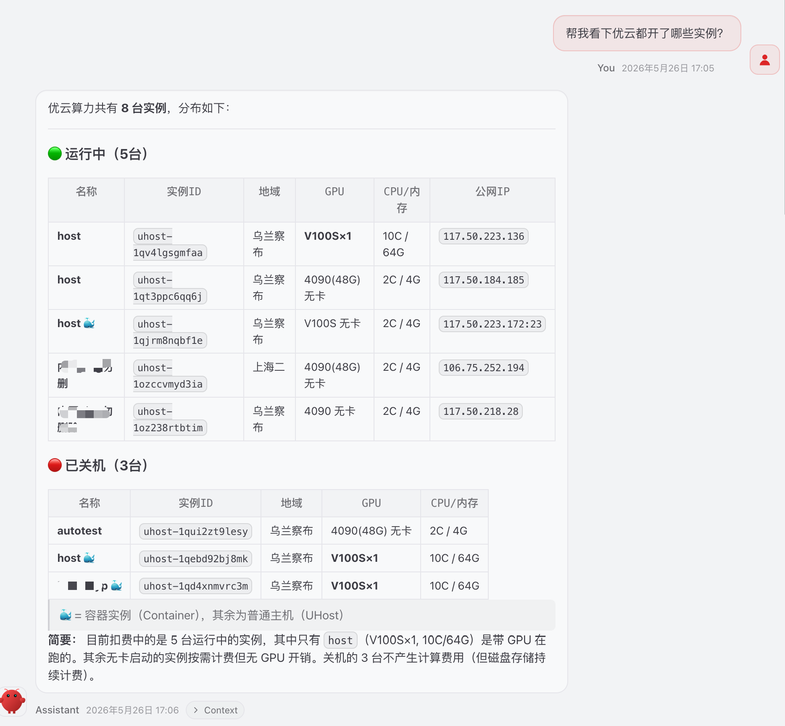

# compshare-skills

## 包含的 skill

| Skill | 用途 |
|-------|------|
| [`compshare-docs`](./compshare-docs) | 引导 AI 通过本地文档仓库回答 CompShare 平台问题（API / 操作指南 / 账户 / 模型服务），避免凭印象给出错误的 Action / 参数 / 步骤。文档源：[BennielAllan/compshare-docs](https://github.com/BennielAllan/compshare-docs)。 |
| [`ucloud-api-invoker`](./ucloud-api-invoker) | 通过本地 `invoker.py` 完成 UCloud / CompShare OpenAPI 的签名与 HTTP 调用，profile 路由到 `api.ucloud.cn` 或 `api.compshare.cn`。Action 与参数应来自 `compshare-docs` / `ucloud-api-docs` 的查询结果。 |

## 使用示例

下面是几个典型对话场景的提示词。安装好两个 skill 后，直接把这些话发给 AI 即可——它会自动决定查文档、调 API，还是先确认再执行。

### 1. 列出我的实例（只读，自动串联）

> 帮我看下优云都开了哪些实例?

AI 会查 `compshare-docs` 找到 `DescribeCompShareInstance`，用 `ucloud-api-invoker` 在 CompShare endpoint 上调用，并归类展示运行中 / 已关机的实例：

### 2. 纯文档问题（不调 API）

> CompShare 的 V100S 实例支持哪几种 CPU/内存配置？
>
> CreateCompShareInstance 的必填参数有哪些？
>
> 错误码 16005 是什么意思？

只触发 `compshare-docs`，AI 翻 `/tmp/compshare-docs` 仓库后引用文档原文，**不会**调真 API。

### 3. 创建实例（写类，先确认）

> 在 CompShare 乌兰察布给我开一台 V100S×1、10C/64G 的实例，镜像用 Ubuntu 22.04，密码我用 xxx

AI 会：
1. 查 `compshare-docs` 拿到 `CreateCompShareInstance` 必填项
2. 列出即将传的参数（密码不回显）
3. 等你**明确确认**后才调 invoker

### 4. 关机 / 销毁（危险操作，强制二次确认）

> 把 uhost-1qjrm8nqbf1e 关机
>
> 销毁 uhost-1qv4lgsgmfaa，磁盘也一起释放

AI 会复述要执行的 Action（`StopCompShareInstance` / `TerminateCompShareInstance`）+ 后果 + 连带参数（如 `ReleaseUDisk`），等你确认后才执行。

### 5. 区分 UCloud 标准产品 vs CompShare

> 用 UCloud API 列一下 cn-bj2 的 UHost 主机

不带 "CompShare / 优云算力" 关键词且 Action 不含 `CompShare` → 走 UCloud 标准 profile（`api.ucloud.cn`），不会落到 CompShare endpoint。

> uhost-1qjrm8nqbf1e 这台机器在哪个平台？

AI 看到裸 `uhost-xxx` 但没平台关键词时**会反问**——两边 ID 格式相同，错选 endpoint 会拿到空集或别人账号的数据。

### 6. 切机型 / 改配置

> 列一下乌兰察布有哪些 V100S 规格可用

触发 `DescribeAvailableCompShareInstanceTypes`，返回实时可用的 CPU/内存/卡数组合（这种实时值文档里不收录，必须调 API）。
