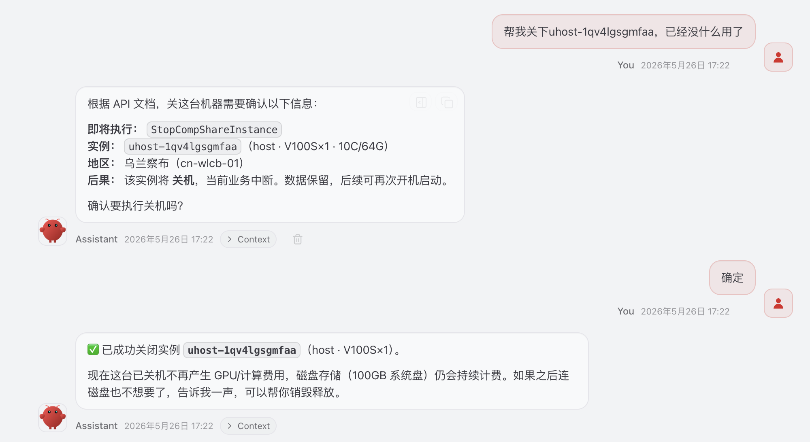

# compshare-skills

## 包含的 skill

| Skill | 用途 |
|-------|------|
| [`compshare-docs`](./compshare-docs) | 引导 AI 通过本地文档仓库回答 CompShare 平台问题（API / 操作指南 / 账户 / 模型服务），避免凭印象给出错误的 Action / 参数 / 步骤。文档源：[BennielAllan/compshare-docs](https://github.com/BennielAllan/compshare-docs)。 |
| [`ucloud-api-invoker`](./ucloud-api-invoker) | 通过本地 `invoker.py` 完成 UCloud / CompShare OpenAPI 的签名与 HTTP 调用，profile 路由到 `api.ucloud.cn` 或 `api.compshare.cn`。Action 与参数应来自 `compshare-docs` / `ucloud-api-docs` 的查询结果。 |

## 使用示例

> 帮我看下优云都开了哪些实例?

> 帮我关下 uhost-1qv4lgsgmfaa, 已经没什么用了

其他提示词示例：

> CompShare 的 V100S 实例支持哪几种 CPU/内存配置？
>
> CreateCompShareInstance 的必填参数有哪些？
>
> 错误码 16005 是什么意思？
>
> 在 CompShare 乌兰察布给我开一台 V100S×1、10C/64G 的实例，镜像用 Ubuntu 22.04
>
> 销毁 uhost-1qv4lgsgmfaa，磁盘也一起释放
>
> 用 UCloud API 列一下 cn-bj2 的 UHost 主机
>
> uhost-1qjrm8nqbf1e 这台机器在哪个平台？
>
> 列一下乌兰察布有哪些 V100S 规格可用
